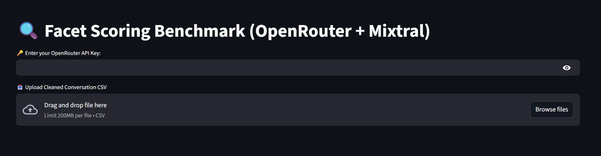

# 🔍 Facet Scoring Benchmark using Open-Weight LLMs (Mixtral + OpenRouter)

This project implements a lightweight, production-ready benchmark for **scoring chatbot responses** across multiple conversation facets like **clarity, empathy, helpfulness, toxicity, and safety** — using **open-weight LLMs** (Mixtral-8x7B via OpenRouter).

---

### 🖼 Landing Page Preview:
<p align="center">
  
</p>

---

## ✅ Project Goals

- 🎯 Automatically evaluate chatbot responses across **300+ facets**
- ✅ Use **open-weight LLMs (≤16B)** — e.g., Mixtral, LLaMA 3 — to score without local model downloads
- ✅ Score scale: 1 to 5 (integer)
- ✅ Design should support **scaling to 5000+ facets**
- ➕ Include **confidence estimation per score**
- ➕ Build a **Dockerized baseline**
- ➕ Create a **Streamlit UI** for demo/interaction

---

## 📁 Files Included

| File | Purpose |
|------|---------|
| `Cleaned_Conversation_Evaluation.csv` | Preprocessed conversation turns |
| `score_facets.py` | Python script to score each turn using Mixtral |
| `Dockerfile` | Container setup for reproducible benchmarking |
| `app.py` | Streamlit UI to upload CSV, choose facet, and run LLM-based scoring |
| `Scored_Conversation_With_Confidence.csv` | Final output with scores and confidence levels |

---

## 🧠 Step-by-Step Workflow

### ✅ 1. Dataset Preprocessing (on Google Colab)

- Cleaned empty rows and whitespace
- Computed:
  - `response_length_words`
  - `sentiment_score` using TextBlob
  - `readability_score` using Flesch–Kincaid
  - Assigned `conversation_id` and `turn_id`

👉 Output: `Cleaned_Conversation_Evaluation.csv`

---

### ✅ 2. Facet Scoring via LLMs (OpenRouter API)

- Used `mistralai/mixtral-8x7b-instruct` via [OpenRouter](https://openrouter.ai)
- Prompted per facet:

- Extracted both:
- `Facet Score` (1–5)
- `Confidence Score`

👉 Output: `Scored_Conversation_With_Confidence.csv`

---

### ✅ 3. Dockerized Baseline (in GitHub Codespaces)

- Wrote a `Dockerfile` to run scoring headlessly
- Built and ran the container like:

```bash
docker build -t facet-benchmark .
docker run --rm \
  -v $(pwd):/app \
  -e OPENROUTER_API_KEY=sk-... \
  facet-benchmark
